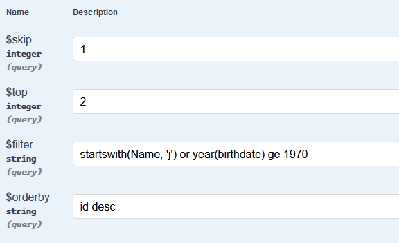

# Queree

Dynamic filtering extensions for `IQueryable` that allows API clients to specify 
[OData][odata] `$filter` , `$orderby`, `$skip`, `$top` query string filter parameters without bringing the whole OData library to the mix.

```c#
[HttpGet]
public IActionResult Index(Query query)
{
    return Ok(_dbContext.Users.ApplyQuery(query).ToList());
}
```


## Example



Giving `?$filter=startswith(Name, 'j') or startswith(name, 'm')&orderby=id desc&skip=1&take=2` will filter a list of actors into this subset:

```json
[
  {
    "id": 6,
    "name": "Jennifer Lawrence",
    "birthDate": "1975-01-01T00:00:00"
  },
  {
    "id": 4,
    "name": "Meryl Streep",
    "birthDate": "1973-01-01T00:00:00"
  }
]
```


## Thanks

This library is created thanks to a [great guide][guide] by [Evgeny Bychkov](https://twitter.com/bychkovea) and [StringToExpression library][lib] 

[odata]: https://www.odata.org/documentation/odata-version-2-0/uri-conventions/#FilterSystemQueryOption
[guide]: http://codewithevgeny.com/web-api-odata/
[lib]: https://github.com/codecutout/StringToExpression